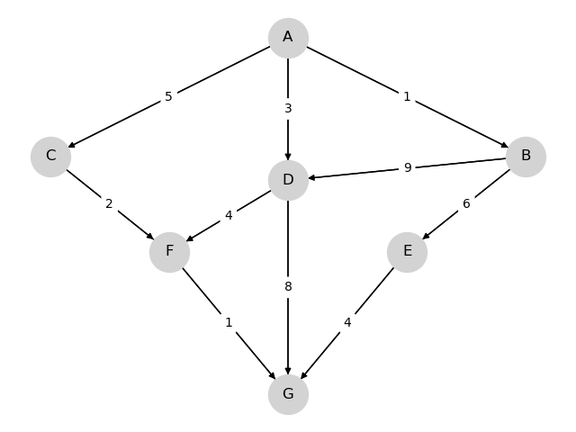

---
jupytext:
  text_representation:
    extension: .md
    format_name: myst
kernelspec:
  display_name: Python 3
  language: python
  name: python3
---

(figures)=
```{raw} html
<div id="qe-notebook-header" align="right" style="text-align:right;">
        <a href="https://quantecon.org/" title="quantecon.org">
                
        </a>
</div>
```

# Figures and Images

```{index} single: Test Corpus; Figures
```

% Patterns from lecture-python-intro/short_path.md and long_run_growth.md
% (figure, mystnb figure metadata), lecture-python-programming/getting_started.md
% (figclass), lecture-dp/career.md (image), continuous_time_mcs/markov_prop.md
% (glue:figure), lecture-python.myst/back_prop.md (youtube) and
% lecture-python-intro/simple_linear_regression.md (raw html iframe).

```{code-cell} ipython3
:tags: [hide-cell]
import numpy as np
import matplotlib.pyplot as plt
```

## Static figures

A bare `{figure}` with an empty caption, the most common form (230 uses):

```{figure} /_static/lecture_specific/short_path/graph.png

```

A named figure with a caption, width and centred alignment, referenced with
`{numref}` as {numref}`fig-shortest-path`:

```{figure} /_static/lecture_specific/short_path/graph4.png
:name: fig-shortest-path
:width: 500px
:align: center

The optimal path A, C, F, G at cost 8.
```

A scaled figure and one with a height:

```{figure} /_static/lecture_specific/short_path/graph.png
:scale: 40%

Scaled to 40 per cent.
```

```{figure} /_static/lecture_specific/short_path/graph.png
:height: 150px

A fixed height of 150 pixels.
```

The `figclass` values the programming lectures set on screenshots:

```{figure} /_static/lecture_specific/short_path/graph.png
:figclass: auto
```

```{figure} /_static/lecture_specific/short_path/graph.png
:figclass: terminal
```

## Images

`{image}` with alignment, a name and a scale (31 uses):

```{image} /_static/lecture_specific/short_path/graph.png
:align: center
:name: img-graph
:scale: 60
```

## Figures from code

A matplotlib figure with a caption and a name attached through `mystnb`
metadata (554 uses, six series), referenced as {numref}`fig-random-walk`:

```{code-cell} ipython3
---
mystnb:
  figure:
    caption: A Gaussian random walk
    name: fig-random-walk
    width: 500px
tags: [hide-input]
---
rng = np.random.default_rng(1234)
fig, ax = plt.subplots()
ax.plot(np.cumsum(rng.standard_normal(200)), lw=2)
ax.set_xlabel("$t$")
ax.set_ylabel("$X_t$")
plt.show()
```

The same metadata with an image `alt` and width but no caption (20 uses):

```{code-cell} ipython3
---
mystnb:
  image:
    alt: Two sine waves
    width: 400px
---
fig, ax = plt.subplots()
x = np.linspace(0, 2 * np.pi, 200)
ax.plot(x, np.sin(x), label="sin")
ax.plot(x, np.cos(x), label="cos")
ax.legend()
plt.show()
```

A figure that is not a figure: a plain plot with no metadata, the most common
output of all (1,933 cells call `plt.show()`).

```{code-cell} ipython3
fig, ax = plt.subplots()
ax.bar(["A", "B", "C"], [3, 5, 2])
plt.show()
```

## Glued figures

`glue` stores an output under a key and `{glue:figure}` places it later
(7 uses in three series):

```{code-cell} ipython3
:tags: [hide-cell]
from myst_nb import glue
fig, ax = plt.subplots()
ax.plot([0, 1, 2, 3], [0, 1, 4, 9], "o-")
glue("flow_fig", fig, display=False)
```

```{glue:figure} flow_fig
:name: "flow_fig"
:figwidth: 600px

A glued figure, placed after the cell that produced it.
```

## Embedded media

A YouTube video (three uses, one series):

```{youtube} rZS2LGiurKY
```

An Our World in Data chart embedded through a `{raw} html` block (two uses):

:::{raw} html
<iframe src="https://ourworldindata.org/grapher/life-expectancy-vs-gdp-per-capita" loading="lazy" style="width: 100%; height: 600px; border: 0px none;"></iframe>
:::

An image tag inside an HTML-only block:

```{only} html

```
